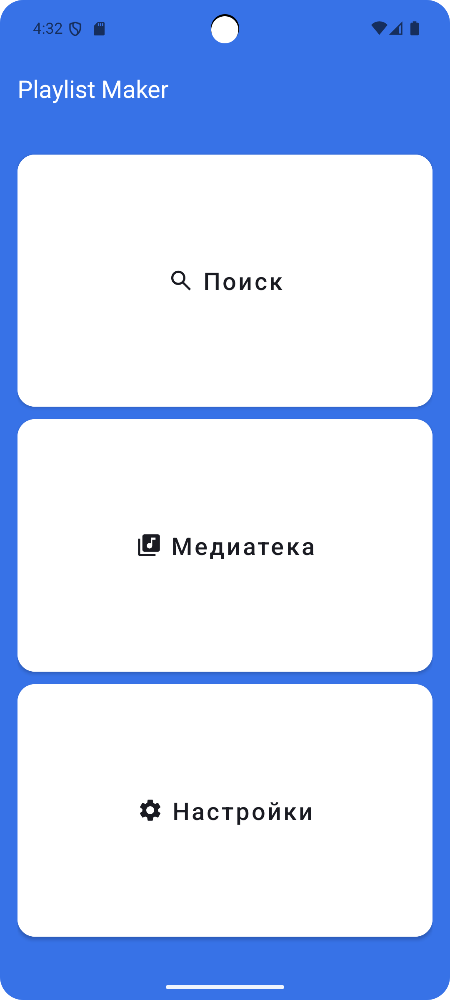

# 🎵 Playlist Maker


Учебный Android-проект для создания музыкальных плейлистов с красивым Material Design интерфейсом.

## 📸 Скриншоты

<div align="center">

| Главный экран | Экран настроек |
|:---:|:---:|
|  |  |

</div>

## 📱 О проекте

Простое приложение с основными экранами для изучения навигации в Android.
Включает главный экран, поиск, медиатеку и настройки.

## ✨ Возможности

- **🎵 Главный экран** - красивый интерфейс с кнопками навигации
- **🔍 Поиск** - экран для поиска музыкальных треков
- **📚 Медиатека** - управление вашей музыкальной коллекцией
- **⚙️ Настройки** - персонализация приложения с возможностью смены темы

## 🚀 Запуск проекта

1. Клонируйте репозиторий:
```bash
git clone https://github.com/your-username/playlist-maker.git
```
Откройте проект в Android Studio

Запустите на эмуляторе или устройстве  Android

## 📁 Структура проекта

```text
app/
├── MainActivity.kt          # Главный экран
├── SearchActivity.kt        # Поиск музыки  
├── MediaActivity.kt         # Медиатека
└── SettingsActivity.kt      # Настройки приложения
```

---

<div align="center">

### 🎓 Учебный проект
**Практикум • 2024**

</div>
